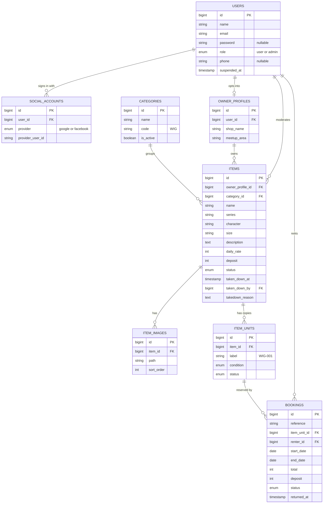
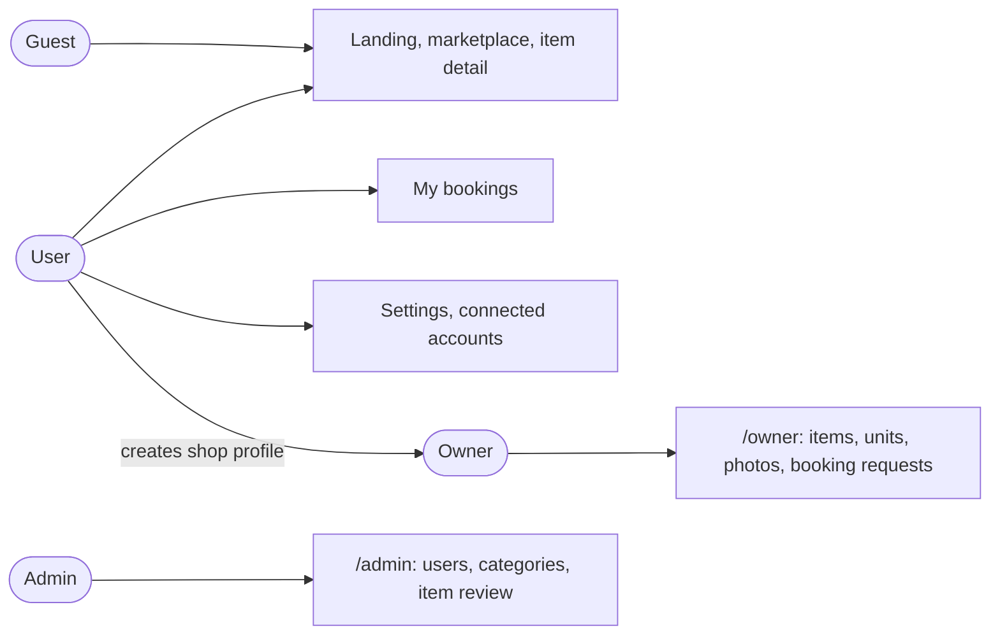
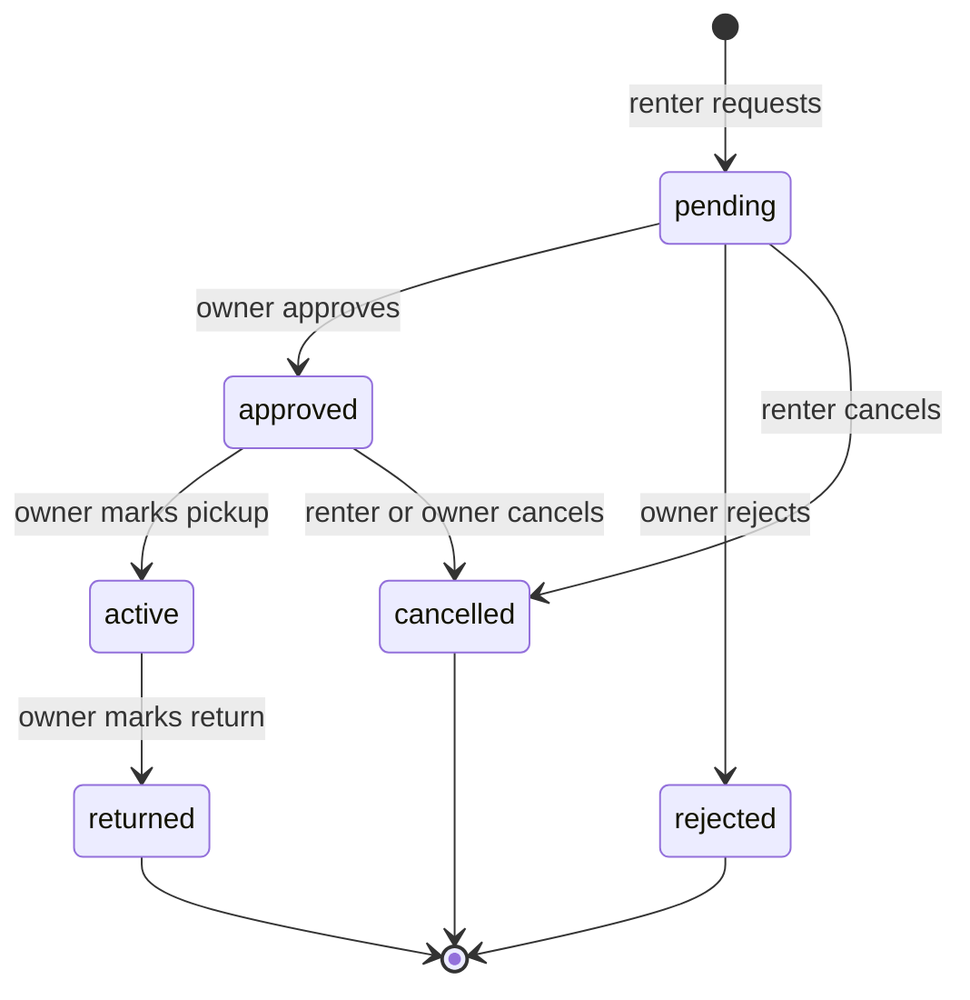
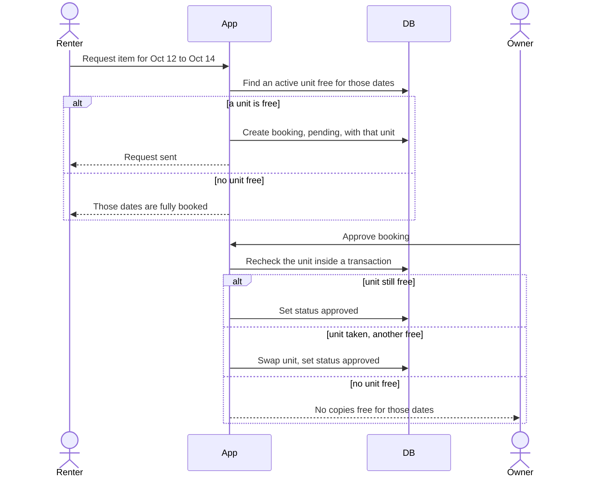
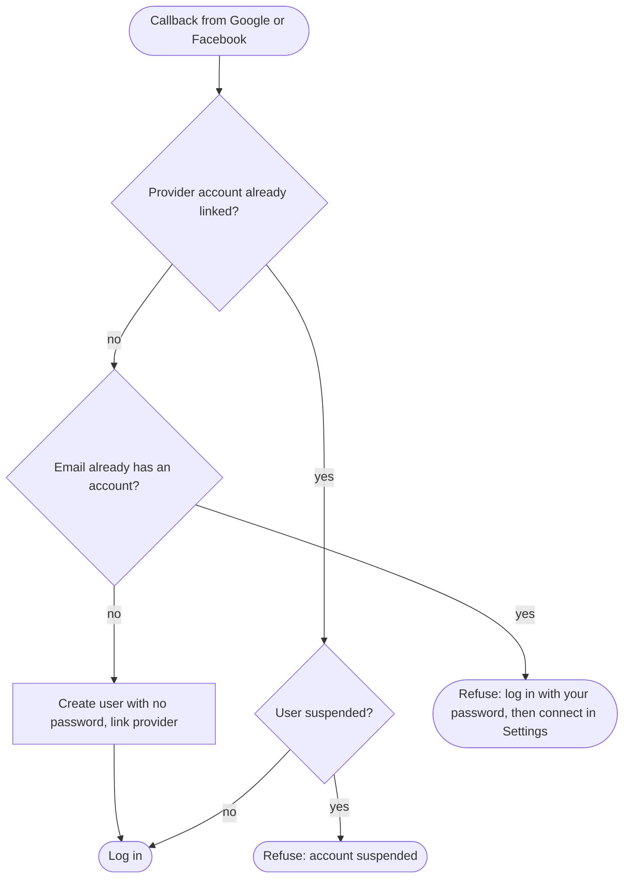
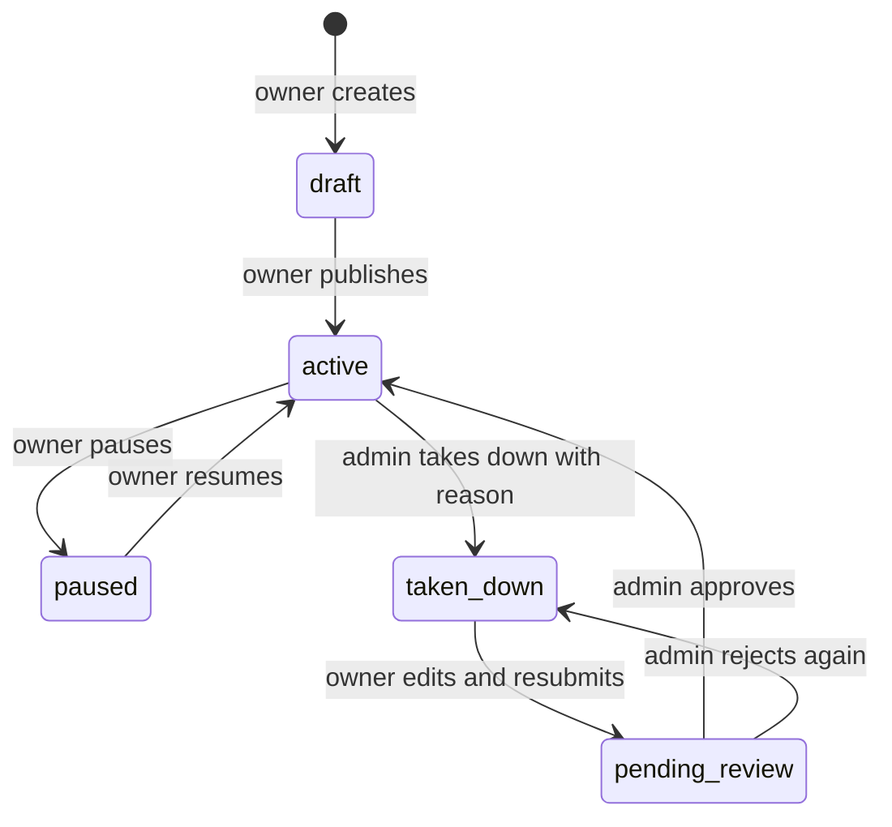

# Diagrams

GitHub renders these Mermaid blocks as diagrams. Rules behind them live in [`PROJECT.md`](../PROJECT.md).

## Entity relationships

Also available as a standalone file: [`erd.mmd`](erd.mmd).

## Areas by role

## Booking lifecycle

## Requesting and approving a booking

## Social login

## Item moderation

